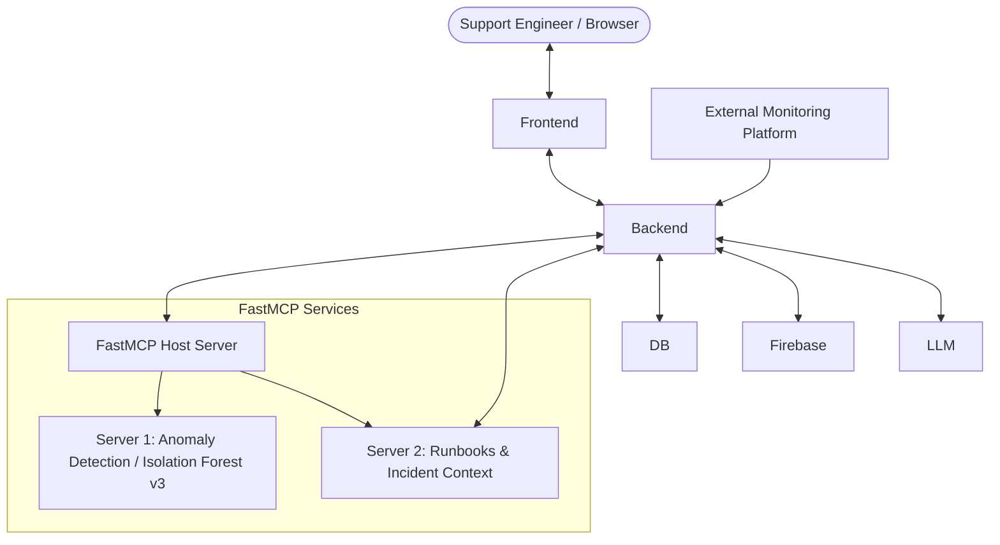
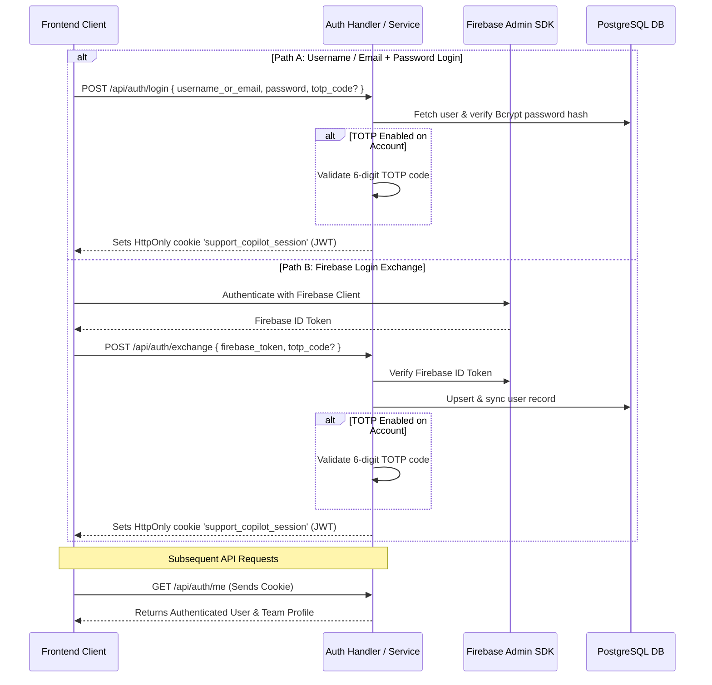

# Support Copilot

Support Copilot is an intelligent, real-time incident management and support engineering assistant. Built with a Go (Echo v5) backend, a React 19 dashboard, and FastMCP Python microservices, Support Copilot integrates streaming AI reasoning, statistical machine learning anomaly detection, automated runbook creation, incident triage, and a unified authentication system supporting both Username/Password and Firebase login with integrated TOTP Multi-Factor Authentication (MFA).

---

## Key Capabilities

- **Real-Time Streaming AI Chat**: Token-by-token streaming responses with explicit tool execution reasoning steps powered by `@assistant-ui/react` and an OpenAI-compatible LLM gateway (e.g., Gemini, Groq, Ollama).
- **Novelty Isolation Forest Anomaly Detection (MCP Server 1)**: Statistical anomaly evaluation using calibrated Novelty Isolation Forest (v3) with continuous Robust Z-score feature extraction across CPU, memory, network traffic, latency, retry rates, and log repetitions.
- **Runbook & Knowledge Base Operations (MCP Server 2)**: Automated runbook generation, search, modification, deprecation, and audit logging linked to specific incidents.
- **Instant Slash Command Interceptor**: Sub-millisecond command execution (`/incident`, `/runbook`, `/alert`, `/quit`) bypassing LLM generation latency.
- **Team-Based RBAC & Multi-Tenancy**: Team workspaces, member invitations, active team context switching, and customizable team-level copilot instructions (minimum 30-character validation).
- **Incident & Alert Lifecycle Management**: Alert ingestion webhooks (`/api/alerts/ingest`), surrogate key referencing (`INC-101`), severity classification, and status transition tracking.
- **Analytics & SLA Dashboard**: Real-time MTTR (Mean Time To Resolution) analytics, incident volume trends, SLA breach monitoring, and global super-admin oversight.
- **Unified Authentication & TOTP MFA**: Flexible dual login options (Username/Email + Password or Firebase Auth) with unified RFC 6238 TOTP Multi-Factor Authentication (QR code provisioning, 6-digit verification) and secure HttpOnly JWT session cookies.

---

## System Architecture



---

## Repository Structure

```text
support_copilot/
├── backend/                  # Go REST API service
│   ├── app/                  # Application initialization, Cobra CLI commands, configuration
│   ├── bin/                  # Local tooling binaries (e.g., Mockery)
│   ├── internal/
│   │   ├── classifier/       # Prompt classification & intent routing
│   │   ├── command/          # Slash command interceptor & handlers (/incident, /runbook, etc.)
│   │   ├── domain/           # Domain models, data transfer objects, validation
│   │   ├── endpoint/         # HTTP handlers (Auth, Teams, Runbooks, Alerts, Dashboard, Admin)
│   │   ├── interfaces/       # Go service & repository interface definitions
│   │   ├── mocks/            # Auto-generated Mockery test mocks
│   │   ├── prompt/           # Dynamic system prompts & remediation instructions
│   │   ├── repository/       # Data persistence (Postgres, Firebase, LLM, MCP clients)
│   │   ├── service/          # Core business logic & orchestration (Unified Auth, Teams, Incidents)
│   │   └── tools/            # Backend tool definitions & execution wrappers
│   ├── middlewares/          # Authentication & internal API key middleware
│   ├── types/                # Shared Go data structures & payload types
│   └── utils/                # Server utilities & helper functions
├── frontend/                 # React 19 SPA (Vite + TypeScript + Tailwind CSS)
│   ├── src/
│   │   ├── components/       # UI components (assistant-ui, analytics, runbooks, incidents, teams)
│   │   ├── context/          # React context providers (Auth, Team, Theme)
│   │   ├── pages/            # View pages (Login, Register, TOTP MFA, Setup TOTP)
│   │   ├── service/          # API client services & Axios configuration
│   │   └── types/            # TypeScript interfaces & domain types
├── mcp_servers/              # FastMCP microservices
│   ├── main.py               # Unified FastMCP host entrypoint (streamable HTTP transport on :9000/mcp)
│   ├── server_1/             # Server 1: Telemetry & Novelty Isolation Forest v3 Anomaly Detection
│   └── server_2/             # Server 2: Knowledge Base & Incident Management
├── db/                       # Database initialization, auto-migrations, and seed data
├── doc/                      # Architecture plans, ERD, data dictionary, UAT & test walkthroughs
├── Makefile                  # Build, test, container management, and development automation
└── docker-compose.yml        # Podman / Docker Compose multi-container setup
```

---

## Technology Stack

| Domain | Technologies |
| :--- | :--- |
| **Backend** | Go 1.25, Echo v5, Cobra CLI, Viper, GORM, PostgreSQL 15, Firebase Admin SDK, Bcrypt, Mockery |
| **Frontend** | React 19, TypeScript, Vite, Tailwind CSS v4, `@assistant-ui/react`, Lucide React, Axios, Firebase Client SDK, QRCode.react |
| **ML & FastMCP** | Python 3.12, FastMCP, scikit-learn (Novelty Isolation Forest v3), Pandas, NumPy, Joblib |
| **AI / LLM** | OpenAI-compatible gateway (Google Gemini, Groq, Ollama), Server-Sent Events (SSE) |
| **DevOps & Testing** | Podman / Docker Compose, PostgreSQL 15 container, Go test suite with coverage reporting |

---

## Configuration & Environment Variables

### 1. Root Configuration (`.env`)

```env
# Database Settings
DB_HOST=
DB_PORT=
DB_USER=
DB_PASSWORD=
DB_NAME=

# Server Configuration
SERVER_PORT=
AUTH_ENABLED=
AUTH_TOTP_REQUIRED=

# Firebase Authentication (Optional if using Username/Password login exclusively)
FIREBASE_PROJECT_ID=your_firebase_project_id
GOOGLE_APPLICATION_CREDENTIALS=

# LLM & AI
LLM_PROVIDER=
LLM_MODEL=
LLM_BASE_URL=
LLM_API_KEY=your_llm_api_key
LLM_TLS_SKIP_VERIFY=true

# Internal Security & MCP Integration
INTERNAL_API_KEY=your_internal_api_key
```

### 2. Frontend Configuration (`frontend/.env`)

```env
VITE_API_BASE_URL=http://localhost:8080
VITE_FIREBASE_PROJECT_ID=your_firebase_project_id
VITE_FIREBASE_AUTH_DOMAIN=your_firebase_auth_domain
VITE_FIREBASE_API_KEY=your_firebase_api_key
VITE_FIREBASE_APP_ID=your_firebase_app_id
```

### 3. MCP Servers Configuration (`mcp_servers/.env`)

```env
MCP_HOST=0.0.0.0
MCP_PORT=9000
MCP_PATH=/mcp
INTERNAL_API_KEY=your_internal_api_key
BACKEND_BASE_URL=http://localhost:8080
```

---

## Running the Application

### Option A: Complete Environment with Containers (Compose)

Spin up PostgreSQL, Go Backend, React Frontend, and FastMCP Server with a single command:

```bash
# Start all container services
make up

# Stop all container services
make down
```

#### Exposed Service Ports:
- **Frontend Dashboard**: [http://localhost:3000](http://localhost:3000)
- **Backend REST API**: [http://localhost:8080](http://localhost:8080)
- **FastMCP Endpoint**: [http://localhost:9000/mcp](http://localhost:9000/mcp)

---

### Option B: Local Development (Step-by-Step)

For active feature development and faster iterative reloads:

1. **Start the PostgreSQL Container:**
   ```bash
   make dev-start
   ```

2. **Run Auto-Migrations & Seed Initial Data:**
   ```bash
   make migrate
   ```

3. **Start FastMCP Python Host:**
   ```bash
   make mcp-servers
   ```
   *(Runs unified FastMCP host on port `9000`)*

4. **Start the Go Backend Server:**
   ```bash
   make dev
   ```
   *(Starts API server with race detector on port `8080`)*

5. **Start the React Frontend:**
   ```bash
   cd frontend
   npm install
   npm run dev
   ```
   *(Starts Vite dev server at [http://localhost:3000](http://localhost:3000))*

---

## Unified Authentication & Session Architecture

Support Copilot implements a flexible authentication layer with unified Multi-Factor Authentication:

1. **Dual Login Options**:
   - **Username / Email & Password**: Authenticate directly against the PostgreSQL user store via bcrypt-hashed credentials (`POST /api/auth/login`).
   - **Firebase Authentication**: Authenticate via Firebase client SDK and exchange the Firebase ID Token for a backend session (`POST /api/auth/exchange`).
2. **Unified TOTP Multi-Factor Authentication (MFA)**:
   - Accounts with TOTP enabled require a 6-digit TOTP challenge (`totp_code`) regardless of which login method is used.
   - Built-in RFC 6238 TOTP generator and validator supporting standard authenticator apps (Google Authenticator, Authy, 1Password).
3. **Session Management**:
   - Both authentication paths issue a secure `support_copilot_session` JWT stored in an `HttpOnly`, `SameSite=Lax` cookie.
   - Authenticated user context is retrieved via `GET /api/auth/me`.



---

## Slash Commands & Interceptors

The copilot includes a built-in command interceptor that executes queries instantly without invoking the LLM:

| Slash Command | Parameters | Description |
| :--- | :--- | :--- |
| `/incident` | `[query \| INC-XXX]` | View active incident details or search team incidents by keyword |
| `/runbook` | `[query]` | List team runbooks or search knowledge base content |
| `/alert` | *None* | List recent global telemetry alerts and correlation statuses |
| `/quit` | *None* | Immediately terminates active LLM stream generation |

---

## MCP Tool Reference
### FastMCP Tool Registry

- **MCP Server 1 (Telemetry & Anomaly Detection)**:
  - `detect_anomalies`: Ingests operational metrics (CPU, memory, traffic, error rate, latency, etc.) and predicts anomaly status using Novelty Isolation Forest v3.
- **MCP Server 2 (Knowledge Base & Incident Operations)**:
  - `create_runbook`: Creates a structured markdown runbook for an incident.
  - `update_runbook`: Updates title or content of an active runbook.
  - `deprecate_runbook`: Archives a runbook to keep the knowledge base clean.
  - `get_runbook`: Retrieves full runbook details.
  - `list_runbooks`: Lists team runbooks filtered by status.
  - `get_incident`: Retrieves cleansed incident context, affected services, and timeline.

---

## Testing & Code Quality

The backend includes a unit test suite with coverage across domain layers, services, handlers, and tools:

```bash
# Run all backend unit tests
make test

# Generate a package-by-package test coverage table
make test-coverage

# Regenerate interface test mocks with Mockery
make generate
```

---

## Documentation & Specifications

Detailed design documents, implementation plans, and walkthroughs are available in the [`doc/`](doc/) directory:
- [System Architecture](doc/overall_system_architecture.md)
- [Database ERD & Schema](doc/database_erd.md)
- [Authentication & MFA Flow](doc/auth.md)
