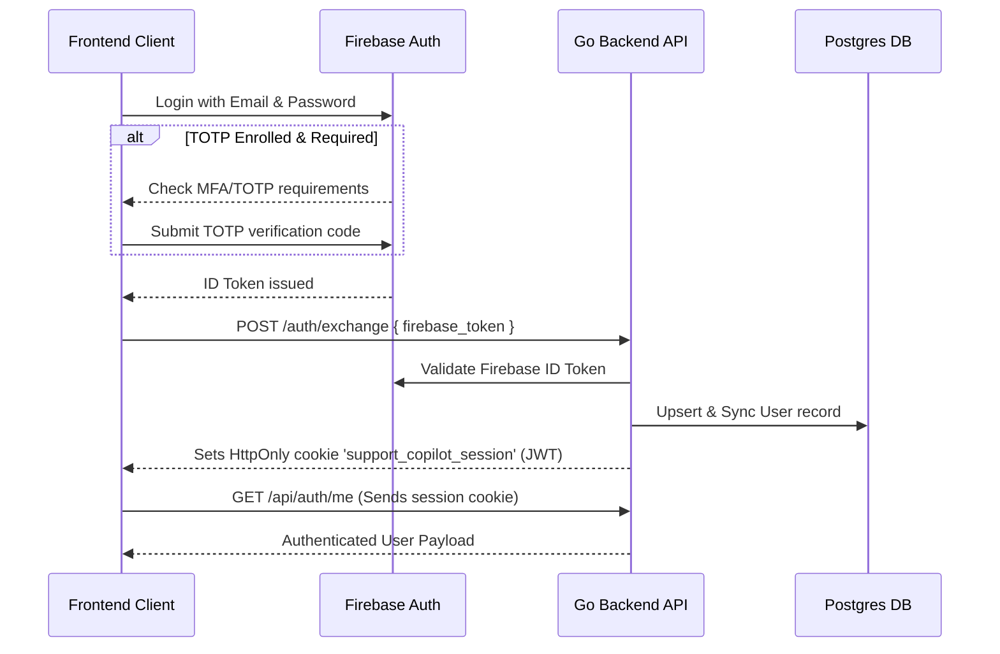

# Support Copilot

Support Copilot is an intelligent incident management and support assistant system featuring a Go backend API, a React frontend dashboard, and FastMCP tool servers. It integrates local LLM execution, slash commands, runbook management, alert linking, and Firebase for secure Authentication (with support for TOTP Multi-Factor Authentication).

---

## 🏗️ Repository Architecture

The project is structured as follows:

*   **[backend/]**: Go-based REST API built using the [Echo v5](https://github.com/labstack/echo) framework.
    *   Uses [Cobra](https://github.com/spf13/cobra) for command-line execution (e.g., database auto-migration/seeding vs. starting the server).
    *   Uses [Viper](https://github.com/spf13/viper) for flexible configuration/environment loading.
    *   Uses [GORM](https://gorm.io/) with PostgreSQL for database persistence.
    *   **`backend/internal/domain/data/`**: Isolated data layer for clean JSON encoding/decoding and type mapping across domain models (alerts, incidents, runbooks).
    *   Integrates with Firebase Admin SDK for verification of user credentials.
*   **[db/]**: Contains database migrations and seeding routines.
*   **[frontend/]**: A React SPA scaffolded with Vite, TypeScript, and Tailwind CSS.
    *   Uses `@assistant-ui/react` for rich, interactive AI chat components.
    *   Integrates Firebase Auth client-side, featuring TOTP MFA registration and verification.
*   **[mcp_server_1/]**: FastMCP Python server for anomaly detection & ML prediction models.
*   **[mcp_server_2/]**: FastMCP server for incident & runbook operations.

---

## 🛠️ Technology Stack

*   **Backend**: Go 1.25, Echo v5, Cobra, Viper, GORM, PostgreSQL, Firebase Admin SDK
*   **Frontend**: React 19, TypeScript, Vite, Tailwind CSS v4, `@assistant-ui/react`, Axios, Firebase SDK
*   **AI Integration**: Ollama / OpenAI-compatible LLM stream gateway, FastMCP Python SDK

---

## ⚙️ Configuration & Environment Variables

> [!IMPORTANT]
> Never commit real secret credentials (passwords, private keys, API tokens) to source control. Populate your `.env` files locally using the placeholder templates below.

### Root Environment (`.env`)
Create a `.env` file in the root workspace directory:

```env
# Database Settings
DB_HOST=localhost
DB_PORT=5432
DB_USER=your_db_user
DB_PASSWORD=your_db_password
DB_NAME=your_db_name

# Firebase Integration
FIREBASE_PROJECT_ID=your_firebase_project_id
FIREBASE_CREDENTIALS_FILE=backend/app/config/serviceAccountKey.json

# LLM & MCP Integration
LLM_BASE_URL=http://localhost:11434
LLM_MODEL=gemini-3.1-flash-lite
LLM_API_KEY=your_llm_api_key

# Internal & Security
AUTH_JWT_SECRET=your_jwt_secret_key
INTERNAL_API_KEY=your_internal_api_key
```

### Frontend Environment (`frontend/.env`)
Create a `.env` file under the `frontend/` directory:

```env
VITE_API_BASE_URL=http://localhost:8080
VITE_FIREBASE_PROJECT_ID=your_firebase_project_id
VITE_FIREBASE_AUTH_DOMAIN=your_firebase_auth_domain
VITE_FIREBASE_API_KEY=your_firebase_api_key
VITE_FIREBASE_APP_ID=your_firebase_app_id
```

---

## 🚀 Running the Application

### Option A: Run via Containers (Compose)
The project includes a `Makefile` that uses **Podman Compose** (or standard Docker Compose) to spin up the complete environment (PostgreSQL, Go Backend, React Frontend, and FastMCP Servers).

*   **Start all services:**
    ```bash
    make up
    ```
    This executes `podman compose up --build`.

*   **Stop all services:**
    ```bash
    make down
    ```

#### Exposed Services:
*   **Frontend Client**: [http://localhost:3000](http://localhost:3000)
*   **Backend API**: [http://localhost:8080](http://localhost:8080)
*   **FastMCP Service**: [http://localhost:9000/mcp](http://localhost:9000/mcp)

---

### Option B: Local Development (Step-by-Step)

If you prefer to run services individually for faster development loops:

1.  **Start the PostgreSQL Database Container:**
    ```bash
    make dev-start
    ```
2.  **Run Database Migrations and Seeding:**
    ```bash
    make migrate
    ```
3.  **Start the Go Backend Server:**
    ```bash
    make dev
    ```
    *(Runs the API server on port `8080`)*
4.  **Start the FastMCP Server:**
    ```bash
    make mcp-servers
    ```
5.  **Start the React Frontend:**
    ```bash
    cd frontend
    npm install
    npm run dev
    ```
    *(Runs the Vite dev server on [http://localhost:3000](http://localhost:3000))*

---

## ⚡ Slash Commands & Interceptor

The copilot features built-in slash command interception that bypasses LLM latency for instant execution:

| Slash Command | Description |
| :--- | :--- |
| `/quit` | Stops active LLM generation |
| `/incident <query>` | Searches active team incidents by title/summary keyword |
| `/alert` | Lists recent global system alerts and their incident links |
| `/runbook <query>` | Searches active team runbooks by title/content keyword |

---

## 🔒 Authentication Flow (Firebase + TOTP)

Support Copilot implements a secure double-token cookie-based authentication flow:



1.  **Firebase Client Auth**: The user signs in via email/password. If TOTP is set up, they complete the TOTP second-factor challenge.
2.  **Token Exchange**: The frontend sends the Firebase ID token to the backend via `POST /auth/exchange`.
3.  **MFA Checking**: The Go backend verifies the ID token with the Firebase Admin SDK.
4.  **Session Establishment**: Upon successful verification, the backend issues an HttpOnly cookie called `support_copilot_session` containing a signed JWT.
5.  **Subsequent Calls**: Endpoints under `/api/*` and `/query/*` require this session cookie.

---

## 🧪 Unit Test

Run backend tests across all modules:

```bash
cd backend
go test ./...
```
