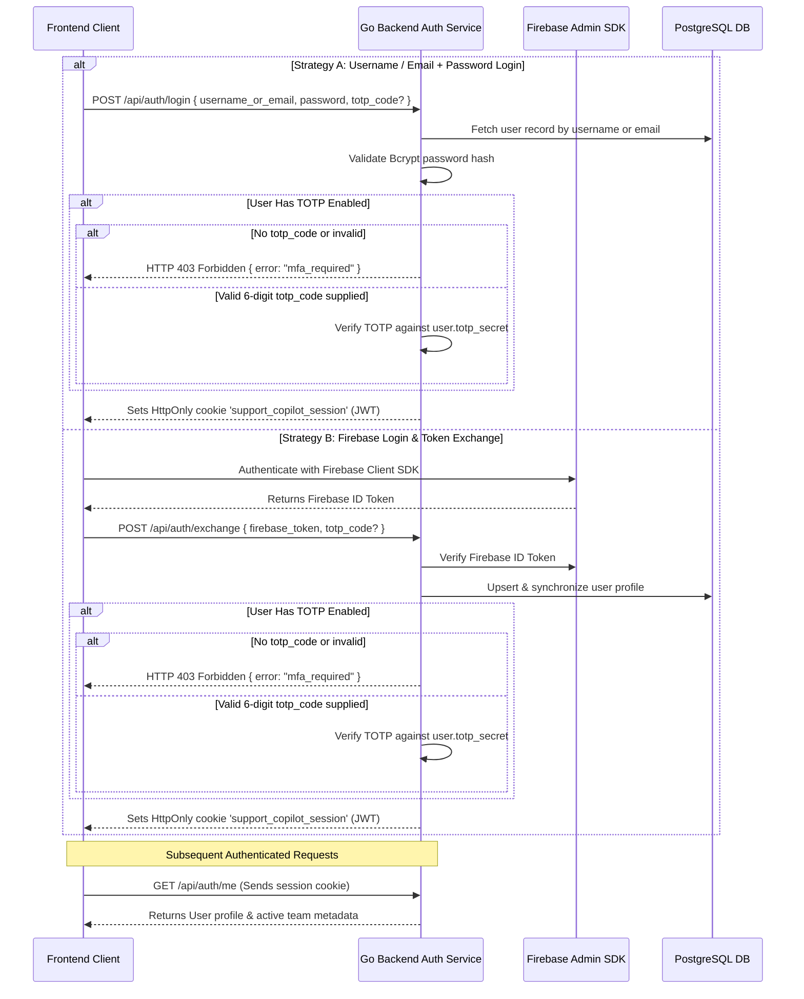
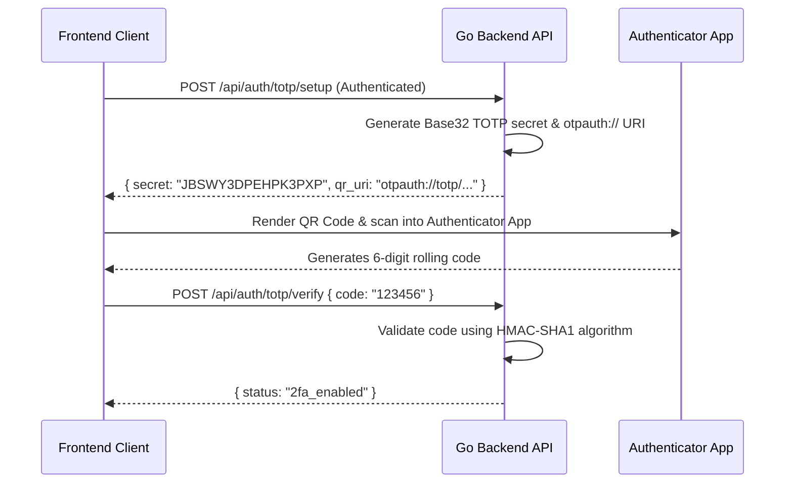
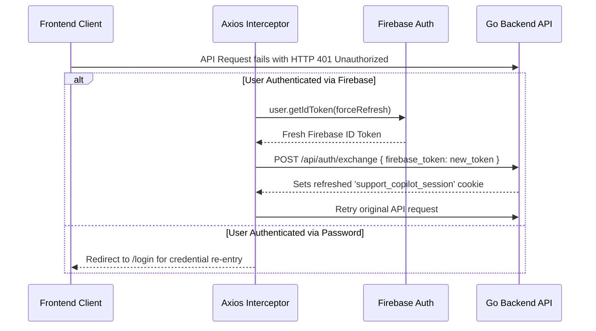

# Authentication, TOTP MFA, and Session Management

This document details the authentication architecture, Multi-Factor Authentication (MFA), and session management in the **Support Copilot** application.

---

## 1. Architecture Overview

Support Copilot implements a unified, state-independent session pattern with dual login strategies and an integrated RFC 6238 Time-Based One-Time Password (TOTP) Multi-Factor Authentication (MFA) engine:

- **Dual Login Support**:
  - **Username / Email + Password**: Authenticated directly against the PostgreSQL database with Bcrypt hash validation (`POST /api/auth/login`).
  - **Firebase Authentication**: Authenticated on the client via Firebase Auth SDK and exchanged on the backend via Firebase Admin SDK (`POST /api/auth/exchange`).
- **Unified TOTP Multi-Factor Authentication**:
  - Accounts with TOTP enabled require a 6-digit verification code (`totp_code`) regardless of which login strategy is used.
  - If MFA is required and no code (or an invalid code) is provided, the backend returns an HTTP `403 Forbidden` with error code `mfa_required`.
- **Session Establishment**:
  - Successful authentication issues a signed HS256 JWT containing the user identity, scope, and team context.
  - The JWT is transmitted in a secure, `HttpOnly`, `SameSite=Lax` cookie named `support_copilot_session` with a 1-hour validity window.
- **Route Authorization**:
  - Protected API routes under `/api/*` and streaming query routes under `/query/*` are guarded by `AuthMiddleware`, which parses and verifies the session cookie.

---

## 2. Authentication and MFA Lifecycle

---

## 3. Unified TOTP Multi-Factor Authentication

Support Copilot incorporates an RFC 6238 TOTP implementation compatible with standard authenticator applications (Google Authenticator, Microsoft Authenticator, Authy, 1Password).

### TOTP Setup and Provisioning

---

## 4. Session Management and Token Rotation

The application avoids database-level stateful session tracking by utilizing signed JWTs wrapped in browser cookies.

