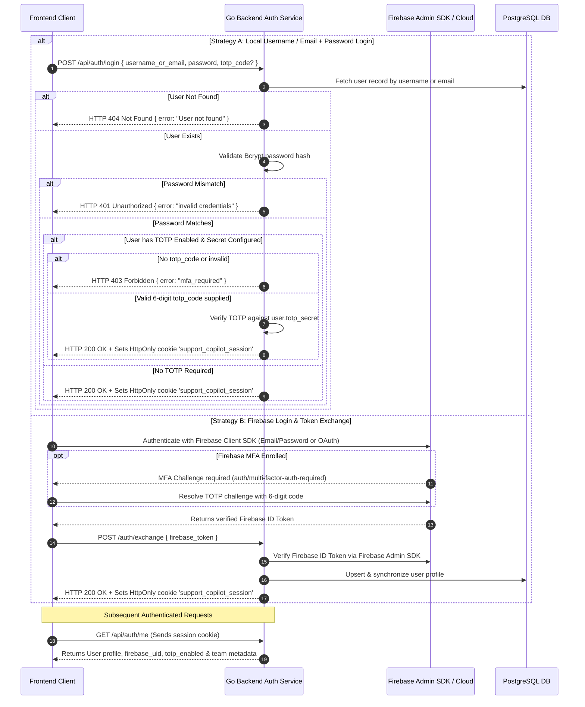
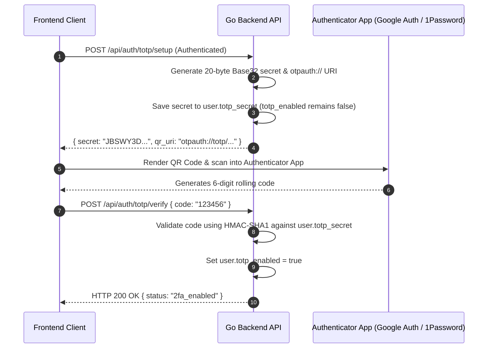
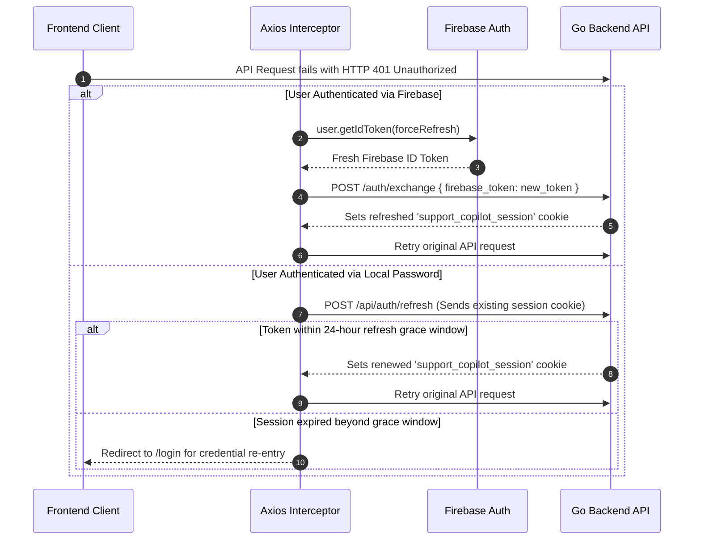

# Authentication, TOTP MFA, and Session Management

This document details the authentication architecture, Multi-Factor Authentication (MFA), and session management in the **Support Copilot** application.

---

## 1. Architecture Overview

Support Copilot implements a state-independent session pattern with dual authentication strategies and an integrated Multi-Factor Authentication (MFA) engine:

- **Dual Login Support**:
  - **Username / Email + Password**: Authenticated directly against the PostgreSQL database with Bcrypt hash validation.
  - **Firebase Authentication (Cloud)**: Authenticated on the client via Firebase Auth SDK (Google OAuth / Email + Password) and exchanged on the backend via Firebase Admin SDK.
- **Separation of 2FA Responsibilities**:
  - **Local Users**: Protected by a self-hosted RFC 6238 TOTP engine managed entirely by the Go backend with secrets stored in PostgreSQL.
  - **Firebase Users**: Protected by Firebase Identity Platform Multi-Factor Authentication, with 2FA enrollment and verification handled directly in Firebase Cloud before issuing the Firebase ID token.
  - **Token Exchange**: The backend verifies the Firebase ID token using the Firebase Admin SDK. Because Firebase verifies cloud MFA before signing the ID token, the backend directly issues the session cookie without requiring a duplicate PostgreSQL TOTP secret (unless a local secret was explicitly provisioned).
- **Session Establishment**:
  - Successful authentication issues a signed HS256 JWT containing the user identity, scope, and authentication method.
  - The JWT is transmitted in a secure, HttpOnly, SameSite=Lax cookie named `support_copilot_session` with a 1-hour validity window.

---

## 2. Authentication Lifecycle

---

## 3. TOTP Multi-Factor Authentication Provisioning

### Local Users (Backend RFC 6238 TOTP)
Local username/password accounts use the Go backend's native RFC 6238 TOTP engine built with standard crypto libraries (`crypto/hmac`, `crypto/sha1`, `encoding/base32`):

### Firebase Users (Firebase Cloud MFA)
Firebase users enroll in MFA directly via the Firebase Auth SDK, storing the 2FA secret in Google Firebase Cloud without requiring a PostgreSQL secret.

---

## 4. Session Management and Token Rotation

The application uses signed JWTs stored in `HttpOnly` browser cookies:

