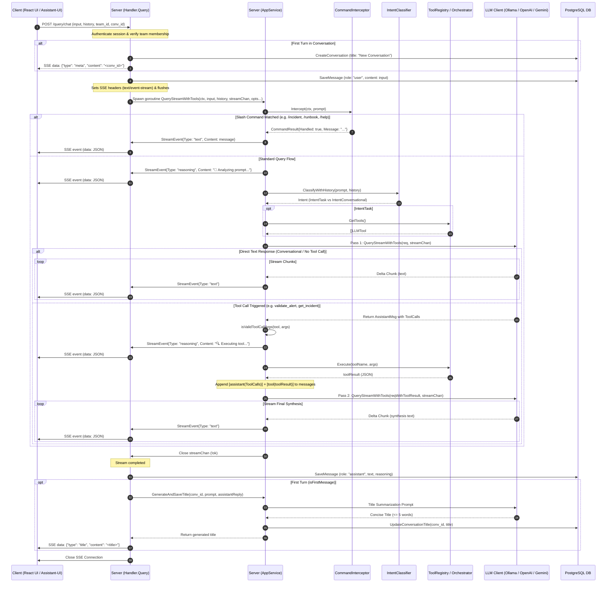
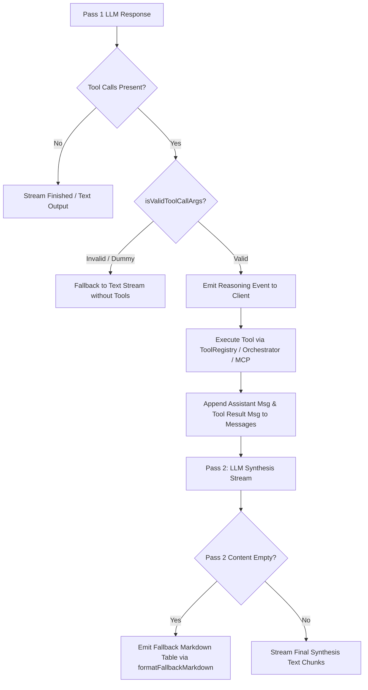

# Streaming Architecture (LLM ↔ Server ↔ Client)

This document explains the real-time query streaming pipeline using Server-Sent Events (SSE), Go channels, multi-provider LLM integration (Ollama, OpenAI, Gemini), agentic tool calling, intent classification, slash commands, and conversation lifecycle management.

---

## High-Level Sequence Diagram



---

## 1. Client ↔ Server Stream (SSE Setup & Lifecycle)

### A. Authentication & Session Validation
Before initiating the stream, the handler validates user authentication context and checks team membership isolation:
```go
uidVal := c.Get("user_uid")
appUID, ok := uidVal.(string)
if !ok || appUID == "" {
    return c.JSON(http.StatusUnauthorized, map[string]string{
        "error": "Authentication required: missing support copilot token context",
    })
}
```

### B. Conversation Management & User Message Persistence
If ConversationID is not supplied, the backend creates a new conversation entry in PostgreSQL and flags isFirstMessage = true. The incoming user prompt is immediately saved to the database:
```go
if req.ConversationID != nil && *req.ConversationID != uuid.Nil {
    convID = *req.ConversationID
} else if req.TeamID != nil && *req.TeamID != uuid.Nil {
    conv, err := h.apps.CreateConversation(ctx, *req.TeamID, dbUser.ID)
    if err == nil && conv != nil {
        convID = conv.ID
        isFirstMessage = true
    }
}

if convID != uuid.Nil {
    _, _ = h.apps.SaveMessage(ctx, convID, "user", req.Input, "")
}
```

### C. SSE Headers & Response Flushing
To initiate SSE streaming, the handler sets standard SSE headers and asserts the http.ResponseWriter to http.Flusher:
```go
resp := c.Response()
resp.Header().Set("Content-Type", "text/event-stream")
resp.Header().Set("Cache-Control", "no-cache")
resp.Header().Set("Connection", "keep-alive")
resp.WriteHeader(http.StatusOK)

flusher, ok := resp.(http.Flusher)
if !ok {
    return c.JSON(http.StatusInternalServerError, map[string]string{"error": "Streaming unsupported"})
}
flusher.Flush()
```

### D. meta Event for New Conversations
If a new conversation was created on the first turn, a meta event is immediately pushed downstream so the React UI can update the URL and active conversation state:
```go
if convID != uuid.Nil && isFirstMessage {
    metaEvent := types.StreamEvent{
        Type:    "meta",
        Content: convID.String(),
    }
    eventJSON, _ := json.Marshal(metaEvent)
    fmt.Fprintf(resp, "data: %s\n\n", eventJSON)
    flusher.Flush()
}
```

### E. Background Goroutine Invocation
The handler passes a typed Go channel (chan types.StreamEvent) to [AppService.QueryStreamWithTools]:
```go
streamChan := make(chan types.StreamEvent)
errorChan := make(chan error, 1)

go func() {
    err := h.apps.QueryStreamWithTools(c.Request().Context(), req.Input, req.History, streamChan, opts...)
    if err != nil {
        errorChan <- err
    }
    close(streamChan)
}()
```

---

## 2. Server Pipeline Orchestration (AppService)

In [service.go], [AppService.QueryStreamWithTools] executes the request lifecycle through modular components:

### A. Slash Command Interception
The service queries [CommandInterceptor]. If the prompt matches registered commands (e.g. `/incident`, `/runbook`, `/alert`), execution bypasses the LLM and streams the result directly:
```go
res, err := s.Intercept(ctx, prompt)
if err != nil {
    return err
}
if res != nil && res.Handled {
    if res.Message != "" {
        streamChan <- types.StreamEvent{
            Type:    "text",
            Content: res.Message,
        }
    }
    return nil
}
```

### B. Live Reasoning Status Indicator
Before calling the LLM, the backend emits an initial reasoning event so the frontend UI displays active thinking status:
```go
streamChan <- types.StreamEvent{
    Type:    "reasoning",
    Content: "🧠 Analyzing prompt and evaluating available tools...\n",
}
```

### C. Dynamic Workspace Context & Team Instructions
The base system prompt ([`system_prompt.md`] is enriched at runtime with active workspace metadata:
```go
systemPrompt := promptpkg.SystemPrompt

if teamID != uuid.Nil || activeIncidentID != uuid.Nil {
    systemPrompt += "\n\n## Current Workspace Context"
    if teamID != uuid.Nil {
        systemPrompt += fmt.Sprintf("\n- Active Team ID: `%s`", teamID.String())
    }
    if activeIncidentID != uuid.Nil {
        systemPrompt += fmt.Sprintf("\n- Active Incident ID: `%s`", activeIncidentID.String())
    }
}

if teamID != uuid.Nil && s.teamRepo != nil {
    inst, _, err := s.teamRepo.GetTeamInstruction(ctx, teamID)
    if err == nil && inst != nil && strings.TrimSpace(inst.InstructionDetails) != "" {
        systemPrompt += fmt.Sprintf("\n\n## Team-Specific Custom Instructions\n\n%s", strings.TrimSpace(inst.InstructionDetails))
    }
}
```

### D. Intent Classification & Tool Gating
The [`IntentClassifier`] evaluates the user prompt and history (`req.History`). For conversational queries (greetings, acknowledgments), tools are withheld to prevent accidental hallucinations:
```go
intent := s.intentClassifier.ClassifyWithHistory(prompt, history)

var availableTools []requests.LLMTool
if intent == classifier.IntentTask {
    availableTools = s.toolRegistry.GetTools()
}
```

---

## 3. Server ↔ LLM Streaming & Chunk Decoding (`ILLMClient`)

The backend abstracts model providers behind [`interfaces.ILLMClient], supporting both local Ollama instances and cloud providers (OpenAI / Gemini via OpenAI-compatible endpoints):

```go
type ILLMClient interface {
    QueryStreamWithTools(ctx context.Context, req requests.LLMChatRequest, streamChan chan<- types.StreamEvent) (*requests.LLMMessage, error)
}
```

### A. Ollama Streaming Client [client.go]
- Sends POST request to `/api/chat` with `"stream": true`.
- Decodes newline-delimited JSON chunks in a stream loop.
- Emits each text chunk to `streamChan` as `StreamEvent{Type: "text"}`.
- Accumulates `ToolCalls` returned in chunk payloads.
- Features retry backoff for rate limits (`429`) and server unavailability (`503`).

### B. OpenAI / Gemini Streaming Client [openai_client.go]- Connects to `/chat/completions` over SSE.
- Parses `data: <JSON>` chunk lines with `bufio.Reader`.
- Extracts `delta.content`, `delta.reasoning_content`, and Google Gemini `thought_signature`.
- Accumulates indexed tool-call deltas (`delta.tool_calls`) across stream chunks into structured [`requests.LLMToolCall`]

---

## 4. Agentic Tool Calling Loop & Multi-Pass Execution

When the LLM triggers one or more tool calls in Pass 1:



### A. Embedded Tool Call Recovery & `drain` Event
If an LLM hallucinates raw JSON tool calls in its text stream instead of structured `tool_calls`, [`LooksLikeEmbeddedToolCall`] parses the embedded call and emits a `drain` event to clear the client's accumulation buffer:
```go
if assistantMsg != nil && classifier.LooksLikeEmbeddedToolCall(assistantMsg.Content) {
    if parsedCall, parseErr := classifier.ParseEmbeddedToolCall(assistantMsg.Content); parseErr == nil {
        assistantMsg.ToolCalls = append(assistantMsg.ToolCalls, *parsedCall)
        assistantMsg.Content = ""
        streamChan <- types.StreamEvent{Type: "drain", Content: ""}
    }
}
```

### B. Guardrails & Argument Validation
[`isValidToolCallArgs`] validates parameters (preventing execution on dummy placeholders like `"null"` or `"00000000-0000-0000-0000-000000000000"`). The service also auto-populates `team_id` from the active context if omitted by the model:
```go
if !isValidToolCallArgs(toolName, toolCall.Function.Arguments) {
    slog.Warn("[APP SERVICE] Tool call skipped due to dummy or missing valid parameters", "tool", toolName)
    // fallback to conversational synthesis
}
```

### C. Tool Execution & Pass 2 Synthesis
1. Emits reasoning event (`🔍 Intercepted tool call: <name>. Executing tool...`).
2. Executes the handler registered in [`ToolRegistry`] (which routes to `OrchestratorService`, PostgreSQL repositories, or Python MCP Servers).
3. Appends the assistant message and tool result to `messages`.
4. Executes Pass 2 with the LLM to stream the synthesized explanation.
5. If Pass 2 returns empty text, [`formatFallbackMarkdown`] renders a structured markdown table from the raw tool JSON.

---

## 5. Multiplexed Event Loop & Finalization (Server ↔ Client)

In [`handler.go`], the handler processes incoming channel events:

```go
var fullAssistantText strings.Builder
var fullReasoningText strings.Builder

for {
    select {
    case event, ok := <-streamChan:
        if !ok {
            // Stream completed cleanly
            if convID != uuid.Nil {
                asstText := fullAssistantText.String()
                reasText := fullReasoningText.String()
                if asstText != "" || reasText != "" {
                    _, _ = h.apps.SaveMessage(context.Background(), convID, "assistant", asstText, reasText)
                }
                if isFirstMessage {
                    title, err := h.apps.GenerateAndSaveTitle(context.Background(), convID, req.Input, asstText)
                    if err == nil && title != "" {
                        titleEvent := types.StreamEvent{
                            Type:    "title",
                            Content: title,
                        }
                        eventJSON, _ := json.Marshal(titleEvent)
                        fmt.Fprintf(resp, "data: %s\n\n", eventJSON)
                        flusher.Flush()
                    }
                }
            }
            return nil
        }

        if event.Type == "text" {
            fullAssistantText.WriteString(event.Content)
        } else if event.Type == "reasoning" {
            fullReasoningText.WriteString(event.Content)
        } else if event.Type == "drain" {
            fullAssistantText.Reset()
            fullReasoningText.Reset()
        }

        eventJSON, _ := json.Marshal(event)
        fmt.Fprintf(resp, "data: %s\n\n", eventJSON)
        flusher.Flush()

    case err := <-errorChan:
        slog.Error("[STREAM ERROR]: query stream failed", "err", err)
        errEvent := types.StreamEvent{
            Type:    "text",
            Content: fmt.Sprintf("\n\n**Error** %s", err.Error()),
        }
        eventJSON, _ := json.Marshal(errEvent)
        fmt.Fprintf(resp, "data: %s\n\n", eventJSON)
        flusher.Flush()
        return nil

    case <-c.Request().Context().Done():
        log.Println("[STREAM]: Client Disconnected (prompt edited or stopped). Aborting stream gracefully.")
        return nil
    }
}
```

---

## 6. SSE Stream Event Types Reference

| Event `type` | Direction | Description | Frontend Handling ([`backendRuntime.ts`]) |
| :--- | :--- | :--- | :--- |
| `meta` | Backend → Client | Sent at stream startup on the first message turn; contains assigned `conversation_id`. | Updates local `activeConvId` and triggers `onConversationCreated(convId)`. |
| `reasoning` | Backend → Client | Emits internal thinking steps, prompt evaluation, and tool execution status notifications. | Appends to reasoning text block rendered inside the reasoning accordion UI. |
| `text` | Backend → Client | Real-time text token chunks, synthesized markdown answers, fallback tables, or error alerts. | Appended sequentially to the active message's main text content. |
| `drain` | Backend → Client | Reset signal triggered when raw JSON tool hallucination is parsed into a structured tool call. | Discards accumulated text and reasoning buffer so the synthesis response renders cleanly. |
| `title` | Backend → Client | Emitted after stream completion on first message turns; contains generated conversation title (<= 5 words). | Triggers `onTitleGenerated(convId, title)` to update the sidebar conversation title immediately. |

---

## 7. Frontend Stream Consumption ([`backendRuntime.ts`])

The frontend consumes the SSE stream via the `@assistant-ui/react` runtime adapter:
1. Dispatches HTTP POST to `/query/chat` with `credentials: "include"` and `AbortSignal`.
2. Employs exponential backoff retry via `fetchWithExponentialBackoff` for transport resilience.
3. Decodes binary chunks using `TextDecoder` and buffers until encountering double newline delimiters (`\n\n`).
4. Strips `data: ` prefix, unmarshals the JSON [`StreamEvent`], and yields formatted `{ content: [{ type: "reasoning", ... }, { type: "text", ... }] }` updates to the UI.
5. On stream completion, dispatches custom event `runbooks-updated` to synchronize related view states.
